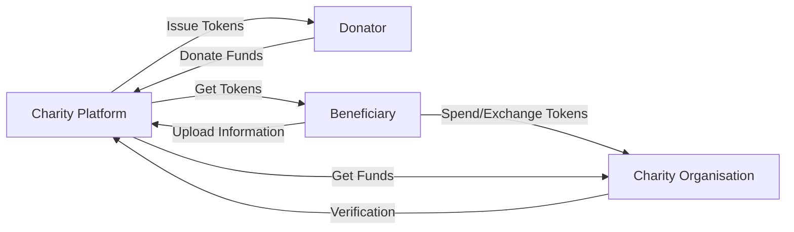

# Stellar Blockchain

## What is Stellar Blockchain?

- Stellar is an open network for storing and moving money.
- Stellar makes it possible to create, send, and trade digital representations of all forms of money: dollars, pesos, bitcoin, pretty much anything. It’s designed so all the world’s financial systems can work together on a single network.
- Stellar's API and SDKs are ready to help you transform the world of finance, and the network’s currency connections could give even a small company the power and reach of an international bank.
- Global Payment Apps Leverage the many currency-backed tokens already on the Stellar network.
- Asset exchanges Use Stellar's built-in decentralized exchange for crypto, forex, or securities. Users can swap between tokens using simple functions built into the protocol.
- Micropayment services Power payments of any size with Stellar's low, flat fees and fast transactions.

reference: https://stellar.org/

## How to create Stellar Smart Contracts?

Smart contracts allow for the transparent and conflict-free exchange of money, shares, and property without using an intermediary. A smart contract can be viewed as the digital version of traditional vending machines. Initially Stellar does not include a smart contract language or a built-in virtual machine to execute codes. Instead, it is optimized for sending, storing and trading value.

However, the Stellar Development Foundation (SDF) announced in October 2022 that the Stellar network’s native smart contracts platform, Soroban, was live on Futurenet. So, anyone interested in building smart contracts on Stellar must know about Soroban. Soroban is a platform for smart contracts that has been purposefully designed and built to be compatible with Stellar.

## Understanding Stellar smart contracts

Stellar does not offer an in-built smart contract language or virtual machine like Ethereum to write smart contract code or optimize the contract’s logic to support features. However, a smart contract on Stellar combines transactions and various constraints to furnish the intended result.

A Stellar Smart Contract (SSC) is expressed as the composition of executed and connected transactions via different constraints. Following are some examples of constraints that can be implemented when creating SSCs:

### Multisignature:
  What keys are required to authorize a specific operation? What are the necessary parties to agree on a circumstance to perform steps? Multisignature is the concept that requires the signatures of various parties to sign transactions originating from an account.

### Atomicity/Batching:
  What operations must take place together or fail? What must happen to cause this to fail or pass? Batching is the concept of involving multiple operations in one transaction. Atomicity ensures that an entire given series of operations in a transaction, upon submission to the network, fails if one operation fails.

### Sequence:
  In what order should a transaction series be processed? What are the dependencies and limitations? The concept of the sequence is shown on the Stellar Network via sequence number. Leveraging sequence numbers in transaction manipulation can ensure that particular transactions do not execute if an alternative transaction is submitted.

### Time bounds:
  When can a transaction be executed? Time bounds are restrictions on the time over which a transaction is valid. Time bounds enable periods to be represented in an SSC.

## Soroban
Launched by Futurenet, Soroban is a platform for smart contracts that has been purposefully designed and built to perform. With the support of a $100 million fund, the native smart contract platform Soroban was launched on the Stellar network in October 2022. Soroban is now live on Futurenet and has issued a call to developers to help it with its smart contract service. The Rust-based code is available for download. The platform will undergo several tests before it launches in early 2023. It is worth noting that the platform has been designed with simplicity and ease of use in mind.

## Transparent and Genuine Charity Application

